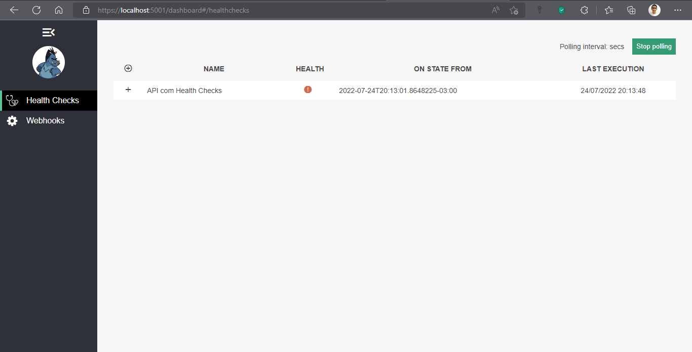
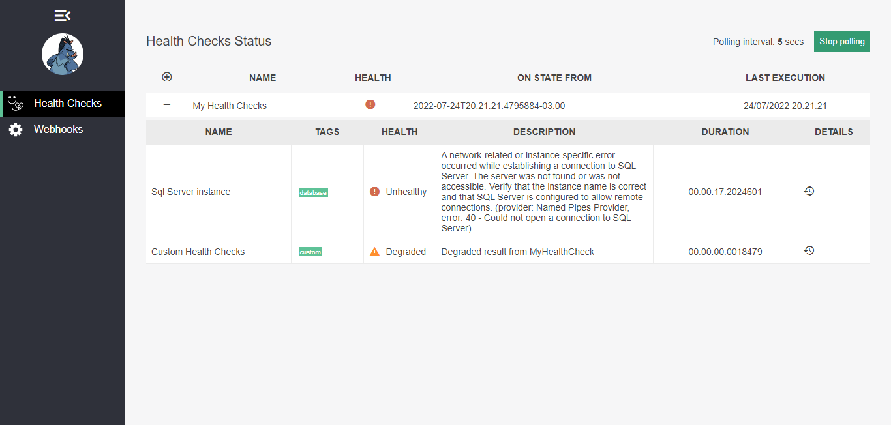

<h1 align="center"><strong>ASP NET Core Health Checks</strong></h1>

    

 

    

 

### ` 🔍 About`

Studying about Health Checks on ASP NET Core web API's

### ` 💡 Topics Covered`

* Health Checks in ASP.NET Core

### `💻 Tools`

#### Front-end, Back-end, versioning and development
* VS Code
* Docker
* SQL Server

### `🔎 How to use?`

$ git clone https://github.com/devjamesbrandao/health-check-api

$ dotnet restore

$ dotnet build

$ Add Connection String on Mapping/SqlConnectionString

$ dotnet run

